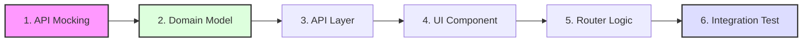

# Agile MVP Frontend Project

본 프로젝트는 React 19 기반의 프론트엔드 애플리케이션으로, **Spring Boot 4 / Java 25** 기반의 백엔드와 완벽하게 조화를 이루는 애자일 MVP 레퍼런스입니다. **Feature-Driven Architecture**를 기반으로 설계되었으며, 순수 도메인 로직과 UI 부수 효과를 엄격히 격리하여 유지보수성과 확장성을 극대화합니다.

---

## 🛠️ 기술 스택

- **언어**: TypeScript 6
- **프레임워크**: React 19 (React DOM)
- **라우팅**: React Router v7 (Data Mode)
- **상태 관리**: TanStack Query v5 (Server), Zustand v5 (Client)
- **데이터 검증**: Zod
- **빌드 툴**: Vite 8
- **UI 프레임워크**: Mantine v9+ (Custom Brand Theme)

## 🎨 UI & Design System

본 프로젝트는 **Mantine v9+**를 기반으로 브랜드 아이덴티티가 반영된 커스텀 테마를 사용합니다.

### 1. 컬러 및 테마

- **Primary Color**: `#FFBC00` (Index 5) / **Secondary Color**: `#4B433E` (Index 5)
- **Typography**: Pretendard 기반의 모던 산세리프 스택 (시스템 글꼴 대비 가독성 최적화)
- **Default Radius**: `sm` (4px)

### 2. 스타일링 원칙

- **No Inline CSS**: `style={{...}}` 사용을 금지하며, Mantine의 **Style Props**(mt, p, gap 등) 또는 **CSS Modules**를 사용합니다.
- **Layout**: `Stack`(수직), `Group`(수평), `Grid` 컴포넌트를 우선 활용하여 레이아웃을 구성합니다.

### 3. 주요 유틸리티 활용

#### 전역 알림 (Toast)

`@mantine/notifications`를 래핑한 `toast` 유틸리티를 사용합니다. 아키텍처 규칙에 따라 `shared/ui` 계층에 위치하며, 통신 에러 등은 `app` 계층에서 제어합니다.

```tsx
import { toast } from "@/shared/ui/toast";
toast.success("성공 메시지");
toast.error("에러 메시지", { title: "오류 발생" });
```

#### 모달 관리 (Modals)

Zustand 대신 Mantine의 `modals` 매니저를 통해 대화상자를 제어합니다.

```tsx
import { modals } from "@mantine/modals";
modals.openConfirmModal({ title: "확인", onConfirm: () => {} });
```

#### 로딩 바 (nprogress)

React Router 전환 시 `@mantine/nprogress` 바가 상단에 자동 표시됩니다.

---

## 📦 주요 프로젝트 의존성 (Dependencies)

`package.json`에 명시된 주요 라이브러리 및 의존성은 다음과 같습니다.

- **React Router** (`react-router`): Loader와 Action을 통한 데이터 사전 적재 및 라우팅 제어
- **TanStack React Query** (`@tanstack/react-query`): 서버 상태 캐싱, 자동 동기화 및 낙관적 업데이트 처리
- **Zod** (`zod`): "Parse, don't validate" 철학을 실현하는 스키마 기반 데이터 파이싱 및 타입 가드
- **Axios** (`axios`): 전역 인터셉터 기반의 HTTP 통신 및 RFC 9457 에러 처리
- **Zustand** (`zustand`): 가벼운 클라이언트 전역 UI 상태 관리
- **MSW** (`msw`): 네트워크 레벨 요청 탈취를 통한 API 모킹 및 테스트 환경 구축
- **Vitest**: 현대적인 테스트 러너를 통한 단위/통합 테스트 수행

---

## 🚀 실행 및 테스트 방법

### 1. 의존성 설치

프로젝트 루트 디렉토리에서 Pnpm을 사용하여 패키지를 설치합니다.

```bash
pnpm install
```

### 2. 애플리케이션 실행 (개발 모드)

다음 명령어를 통해 Vite 개발 서버를 기동합니다.

```bash
pnpm dev
```

### 3. 테스트 실행 및 리포트 확인

전체 단위 및 통합 테스트를 수행합니다.

```bash
# 전체 테스트 실행
pnpm test

# 테스트 감시 모드 (개발 시)
pnpm test:watch
```

### 4. 운영 배포용 빌드

최적화된 정적 자산으로 프로젝트를 컴파일합니다.

```bash
pnpm build
```

---

## 📂 프로젝트 구조 (Project Structure)

FSD(Feature-Sliced Design) 세그먼트 명칭을 차용하여 관심사를 분리하며, 도메인 단위로 캡슐화합니다.

```text
.
├── src
│   ├── app                      # ⚙️ [전역 설정] 앱 진입점, Router, QueryClient, 전역 Store
│   ├── shared                   # 🌐 [공유 커널] 도메인 무관 공통 인프라/UI 계층
│   │   ├── api/                 # axios.ts (순수 통신 및 에러 파이싱)
│   │   ├── model/               # problemDetail.ts (전역 표준 예외 스키마)
│   │   └── ui/                  # 디자인 시스템 및 UI 유틸 (toast, AppHeader, NotFoundPage 등)
│   ├── features                 # 📦 [도메인 모듈] 철저히 캡슐화된 기능 단위
│   │   └── sample               # [예시: Sample 도메인 패키지]
│   │       ├── model/           # 🟢 [순수 영역] 타입, Zod 스키마, 순수 비즈니스 로직 (core.ts)
│   │       ├── api/             # 🔴 [부수 효과 영역] Fetcher, Query Factory(queries.ts)
│   │       ├── ui/              # 🔴 [UI 영역] 도메인 특화 뷰 컴포넌트
│   │       └── routes/          # 🔴 [제어 영역] 라우터 진입 및 Data Mode (loader/action)
│   ├── mocks                    # 🚩 [API 모킹] MSW 인메모리 DB 및 핸들러 설정
│   └── tests                    # 🔍 [테스트 설정] Vitest 전역 setup 및 환경 구성
├── public                       # 정적 리소스 및 MSW 워커 파일
├── package.json                 # 빌드 설정 및 의존성
└── README.md                    # 프로젝트 문서
```

---

## 🛠️ 개발자 워크플로우 (Standard Developer Workflow)

본 프로젝트는 기능 개발 시 **"Mock-First, Logic-Centralized"** 흐름을 지향합니다.

### 🔄 전체 개발 프로세스 요약



### 1. API 모킹 및 가상 데이터 설계 (`mocks/`)

- **`db.ts`**: 신규 도메인 엔티티 정의 및 초기 상태 설정.
- **`handlers.ts`**: REST API 엔드포인트 모킹 (가상 DB와 연결하여 CRUD 동작 구현).

### 2. 도메인 모델링 (`features/[domain]/model/`)

- **`types.ts`**: 도메인 데이터 및 API 요청/응답 타입 정의.
- **`schemas.ts`**: Zod를 활용한 런타임 데이터 검증 스키마 작성.
- **`core.ts`**: `FormData` 파싱 및 도메인 연산을 위한 **Stateless 순수 함수** 작성.

### 3. API 인프라 구축 (`features/[domain]/api/`)

- **`fetchers.ts`**: Axios 기반의 실제 API 호출 함수 작성 (Zod 스키마로 응답 파싱).
- **`mutations.ts`**: TanStack Query `useMutation` 및 Invalidation 로직 정의.
- **`queries.ts`**: Query Key Factory 및 캐시 옵션(`staleTime` 등) 중앙화.

### 4. UI 개발 및 데이터 바인딩 (`features/[domain]/ui/`)

- 도메인 특화 뷰 컴포넌트 개발.
- `TanStack Query` 훅을 사용하여 서버 상태 구독 및 UI 렌더링.

### 5. 라우터 및 데이터 제어 설정 (`features/[domain]/routes/`)

- **`loader.ts`**: 페이지 진입 시 필요한 데이터를 사전 적재(Prefetch)하여 Waterfall 방지.
- **`action.ts`**: `core.ts`를 활용하여 폼 제출 처리를 수행하고, 성공 시 캐시 무효화 수행.

### 6. 전체 통합 테스트 (`[Feature]Integration.test.tsx`)

- `createMemoryRouter`를 활용하여 `UI -> Router Action -> API Mock -> UI` 전체 파이프라인 검증.

---

## 🏷️ 데이터 파이프라인 및 아키텍처 시너지

백엔드(Java 25/Spring Boot 4)와의 긴밀한 설계를 통해 프론트엔드 아키텍처의 효용을 극대화합니다.

### 1. 순수 DTO와 Zod 파이프라인의 결합

- **BE 전략**: 공통 래핑 없이 순수 DTO 반환
- **FE 시너지**: 불필요한 뎁스 탐색 없이 `api/fetchers.ts` 계층에서 Zod 스키마로 직접 파싱하여 데이터 무결성 확보

### 2. RFC 9457 표준 에러 처리 (ProblemDetail)

백엔드의 모든 예외는 `application/problem+json` 표준을 따르며, FE는 이를 다음과 같이 처리합니다.

| 필드     | 설명             | FE 매핑 및 활용                 |
| -------- | ---------------- | ------------------------------- |
| `type`   | 에러 식별 URN    | 에러 유형별 조건부 로직 처리    |
| `title`  | 에러 코드 이름   | 디버깅 및 로깅 활용             |
| `status` | HTTP 상태 코드   | Router `errorElement` 트리거    |
| `detail` | 상세 설명        | `app/queryClient`의 전역 핸들러에서 `Toast` UI로 출력 |
| `errors` | 필드별 검증 목록 | 폼 필드 하단 에러 메시지 바인딩 |

### 3. Feature Flag 기반 애자일 개발

- **BE 전략**: `@FeatureToggle`을 통한 런타임 엔드포인트 제어
- **FE 시너지**: 미완성 UI 세그먼트를 감추거나, 404 응답 시 앱 크래시를 방지하는 `Fallback UI`를 통해 잦은 Main 병합 지원

---

## 🛠️ 상태 관리 및 Zustand 가이드

본 프로젝트에서 Zustand는 **순수하게 UI/UX만을 위한 데이터**를 관리하며, 다음 우선순위에 따라 사용을 제한합니다.

### 🚫 Zustand 사용 제한 (우선순위)

1. **API 응답 데이터**: 100% **TanStack Query**에 위임
2. **컴포넌트 로컬 상태**: `useState` 또는 `useReducer` 사용
3. **URL 상태**: 검색, 필터, 페이지네이션 등 검색 복구가 필요한 상태는 **React Router**로 관리

### 💡 useAppStore 통합 원칙

인지 부하 감소와 디버깅 일원화를 위해 모든 전역 UI 상태는 `src/app/store/useAppStore.ts`로 통합합니다.

```typescript
// src/app/store/useAppStore.ts
export const useAppStore = create<AppState>()(
  persist(
    (set) => ({
      colorScheme: "light",
      toggleColorScheme: () =>
        set((state) => ({
          colorScheme: state.colorScheme === "dark" ? "light" : "dark",
        })),
    }),
    { name: "app-storage" },
  ),
);
```

---

## 🚩 API 모킹 및 MSW 가이드 (API Mocking)

백엔드 없이 단독 개발 및 테스트를 가능하게 하는 **MSW** 활용 가이드입니다.

### 1. 모킹 계층 구조

- **`src/mocks/db.ts`**: 인메모리 가상 데이터베이스. 매 테스트 전 `resetSamples()`로 초기화 권장.
- **`src/mocks/handlers.ts`**: HTTP 요청을 가로채어 가상 DB와 연결하는 인터셉터.
- **`src/mocks/browser.ts` / `server.ts`**: 개발 환경(Browser) 및 테스트 환경(Node) 구동 설정.

### 2. 신규 API 모킹 방법

1. **데이터 정의**: `db.ts`에 초기 데이터 및 CRUD 메서드 추가.
2. **핸들러 등록**: `handlers.ts`에 엔드포인트를 정의하고 `db` 메서드 연결.
3. **테스트 연동**: 통합 테스트의 `beforeEach`에서 `resetSamples()` 호출하여 데이터 격리 보장.

---

## 🔍 테스트 아키텍처 가이드

사용자의 실제 경험(Full Flow)을 보장하는 테스트를 지향합니다.

### 1. 핵심 통합 테스트 (Full Flow)

`createMemoryRouter`를 활용하여 `UI → Router → API(MSW) → UI` 전체 파이프라인을 검증합니다.

- **위치**: `src/features/sample/SampleIntegration.test.tsx`

### 2. 테스트 작성 원칙

- **해피 패스 우선**: 가장 빈번한 시나리오를 통합 테스트로 우선 구축.
- **결정론적 테스트**: MSW를 통해 네트워크 레벨에서 일관된 응답 보장.

---

## 📘 부록: 아키텍처 결정 기록 (ADR Summary)

개발 시 참고해야 할 주요 기술적 결정 사항 요약입니다.

- **ADR 1 (상태 분리)**: 서버 상태는 Query, UI 상태는 Zustand가 전담 (성능 및 제어권 확보).
- **ADR 2 (Data Mode)**: 라우팅 단계(`Loader`)에서 데이터를 사전 적재하여 Waterfall 로딩 방지.
- **ADR 3 (FP 모델링)**: Zod를 통한 데이터 파싱 후 시스템 내부에서는 불변 객체와 순수 함수로만 로직 처리. 특히 `model/core.ts`에 상태가 없는(Stateless) 도메인 연산을 밀집시킴.
- **ADR 4 (Query Factory)**: 캐시 Key와 Option을 도메인별 `api/queries.ts`에서 중앙 통제.
- **ADR 5 (PUT 통일)**: 리소스 수정 시 생산성과 불변성 유지를 위해 **PUT(전체 교체)**을 기본으로 함.
- **ADR 6 (Validation SSOT)**: FE는 파싱에 집중하고, 복잡한 비즈니스 검증은 BE 에러 응답에 위임.
- **ADR 7 (점진적 FSD)**: 단순 기능은 `shared/ui` 등을 활용하여 엄격한 4단계 파일 분할 오버헤드 방지.
- **ADR 8 (Global Error Handling)**: `shared/api`는 UI를 참조하지 않고 에러만 던지며, `app/queryClient`에서 전역적으로 UI(Toast)를 제어함 (제어의 역전, IoC).

## 🛡️ 아키텍처 가드레일 (Architectural Guardrails)

본 프로젝트는 **"폴더가 곧 성벽이다"**라는 원칙 아래, ESLint(`eslint-plugin-boundaries`)를 통해 물리적으로 의존성 방향을 강제합니다. 이는 대규모 프로젝트에서도 코드의 스파게티화를 방지하고 팀 간 병렬 개발을 가능하게 합니다.

### 1. 핵심 의존성 규칙 (Dependency Rules)

| 대상 (Zone)  | 제한 사항 (Restricted From) | 이유 및 해결책                                                                              |
| :----------- | :-------------------------- | :------------------------------------------------------------------------------------------ |
| `features/A` | `features/B`                | **피처 간 독립성**: 피처는 서로의 존재를 몰라야 합니다. 공유 필요 시 `shared`로 승격하세요. |
| `shared`     | `features`, `app`           | **공유 계층 순수성**: 하위 계층이 상위 도메인 지식을 가지면 순환 참조가 발생합니다.         |
| `*/model`    | `api`, `ui`, `routes`       | **모델 순수성**: 도메인 로직은 I/O나 UI에 의존하지 않는 순수 함수여야 합니다.               |
| `*/ui`       | `routes`                    | **UI 멍청함 유지**: 컴포넌트는 제어 로직을 직접 알지 말고 `props`로 주입받아야 합니다.      |
| `*/api`      | `ui`, `routes`              | **역할 격리**: 데이터 통신 레이어는 화면 구성이나 경로 정보를 알 필요가 없습니다.           |

### 2. 인프라 통제 (Infrastructure Control)

- **Axios 직접 사용 금지**: `import axios from 'axios'`를 직접 호출하지 마세요.
- **해결책**: 반드시 `@shared/api/axios`에 정의된 `api` 인스턴스를 사용하세요. 그래야만 전역 인터셉터와 표준 에러 처리 로직이 누락되지 않습니다.

### 3. 적용 방식

- 초기 도입 시에는 개발 생산성을 위해 **`warn`** 레벨로 설정되어 있습니다.
- 단, CI/CD 파이프라인에서는 이를 에러로 간주하여 아키텍처를 위반한 코드가 메인 브랜치에 병합되는 것을 물리적으로 차단합니다.

---

## 🔗 관련 문서 바로가기

- **[전체 프로젝트 루트 (Root)](../../README.md)**
- **[백엔드 레파지토리 (Spring Boot)](../backend-repo/README.md)**
