# Agile MVP Frontend Project

본 프로젝트는 React 19 기반의 프론트엔드 애플리케이션으로, **Spring Boot 4 / Java 25** 기반의 백엔드와 완벽하게 조화를 이루는 애자일 MVP 레퍼런스입니다. **Feature-Driven Architecture**를 기반으로 설계되었으며, 순수 도메인 로직과 UI 부수 효과를 엄격히 격리하여 유지보수성과 확장성을 극대화합니다.

---

## 🛠️ 기술 스택

- **언어**: TypeScript 6
- **프레임워크**: React 19 (React DOM)
- **라우팅**: React Router v7 (Data Mode)
- **상태 관리**: TanStack Query v5 (Server), Zustand v5 (Client)
- **데이터 검증**: Zod
- **빌드 툴**: Vite 8
- **UI 프레임워크**: Mantine v9+ (Custom Brand Theme)

## 🎨 UI & Design System

본 프로젝트는 **Mantine v9+**를 기반으로 브랜드 아이덴티티가 반영된 커스텀 테마를 사용합니다.

### 1. 컬러 및 테마

- **Primary Color**: `#FFBC00` (Index 5) / **Secondary Color**: `#4B433E` (Index 5)
- **Typography**: Pretendard 기반의 모던 산세리프 스택 (시스템 글꼴 대비 가독성 최적화)
- **Default Radius**: `sm` (4px)

### 2. 스타일링 원칙

- **No Inline CSS**: `style={{...}}` 사용을 금지하며, Mantine의 **Style Props**(mt, p, gap 등) 또는 **CSS Modules**를 사용합니다.
- **Layout**: `Stack`(수직), `Group`(수평), `Grid` 컴포넌트를 우선 활용하여 레이아웃을 구성합니다.

### 3. 주요 유틸리티 활용

#### 전역 알림 (Toast)

`@mantine/notifications`를 래핑한 `toast` 유틸리티를 사용합니다. 아키텍처 규칙에 따라 `shared/ui` 계층에 위치하며, 통신 에러 등은 `app` 계층에서 제어합니다.

```tsx
import { toast } from "@/shared/ui/toast";
toast.success("성공 메시지");
toast.error("에러 메시지", { title: "오류 발생" });
```

#### 모달 관리 (Modals)

Zustand 대신 Mantine의 `modals` 매니저를 통해 대화상자를 제어합니다.

```tsx
import { modals } from "@mantine/modals";
modals.openConfirmModal({ title: "확인", onConfirm: () => {} });
```

#### 로딩 바 (nprogress)

React Router 전환 시 `@mantine/nprogress` 바가 상단에 자동 표시됩니다.

---

## 📦 주요 프로젝트 의존성 (Dependencies)

`package.json`에 명시된 주요 라이브러리 및 의존성은 다음과 같습니다.

- **React Router** (`react-router`): Loader와 Action을 통한 데이터 사전 적재 및 라우팅 제어
- **TanStack React Query** (`@tanstack/react-query`): 서버 상태 캐싱, 자동 동기화 및 낙관적 업데이트 처리
- **Zod** (`zod`): "Parse, don't validate" 철학을 실현하는 스키마 기반 데이터 파이싱 및 타입 가드
- **Axios** (`axios`): 전역 인터셉터 기반의 HTTP 통신 및 RFC 9457 에러 처리
- **Zustand** (`zustand`): 가벼운 클라이언트 전역 UI 상태 관리
- **MSW** (`msw`): 네트워크 레벨 요청 탈취를 통한 API 모킹 및 테스트 환경 구축
- **Vitest**: 현대적인 테스트 러너를 통한 단위/통합 테스트 수행

---

## 🚀 실행 및 테스트 방법

### 1. 의존성 설치

프로젝트 루트 디렉토리에서 Pnpm을 사용하여 패키지를 설치합니다.

```bash
pnpm install
```

### 2. 애플리케이션 실행 (개발 모드)

다음 명령어를 통해 Vite 개발 서버를 기동합니다.

```bash
pnpm dev
```

### 3. 애플리케이션 빌드

```bash
pnpm build
```

### 4. API 타입 및 Zod 스키마 자동 생성

백엔드 OpenAPI 명세를 기반으로 프론트엔드 타입을 동기화합니다. (백엔드 서버 기동 필요)

```bash
pnpm generate:api
```

- 생성 위치: `src/features/[feature]/model/generated/`
- 직접 수정하지 마세요. (Manual 파일에서 import하여 사용)

### 5. 테스트 실행 및 리포트 확인

전체 단위 및 통합 테스트를 수행합니다.

```bash
# 전체 테스트 실행
pnpm test

# 테스트 감시 모드 (개발 시)
pnpm test:watch
```

---

## 📂 프로젝트 구조 (Project Structure)

FSD(Feature-Sliced Design) 세그먼트 명칭을 차용하여 관심사를 분리하며, 도메인 단위로 캡슐화합니다.

```text
.
├── src
│   ├── app                      # ⚙️ [전역 설정] 앱 진입점, Router, QueryClient, 전역 Store
│   ├── shared                   # 🌐 [공유 커널] 도메인 무관 공통 인프라/UI 계층
│   │   ├── api/                 # axios.ts (순수 통신 및 에러 파이싱)
│   │   ├── model/               # problemDetail.ts (전역 표준 예외 스키마)
│   │   └── ui/                  # 디자인 시스템 및 UI 유틸 (toast, AppHeader, NotFoundPage 등)
│   ├── features                 # 📦 [도메인 모듈] 철저히 캡슐화된 기능 단위
│   │   └── sample               # [예시: Sample 도메인 패키지]
│   │       ├── model/           # 🟢 [순수 영역] 타입, Zod 스키마, 순수 비즈니스 로직 (core.ts)
│   │       │   └── generated/   # ⚠️ [자동 생성] Orval로 생성된 DTO 타입 및 Zod 스키마 (수정 금지)
│   │       ├── api/             # 🔴 [부수 효과 영역] Fetcher, Query Factory(queries.ts)
│   │       ├── ui/              # 🔴 [UI 영역] 도메인 특화 뷰 컴포넌트
│   │       └── routes/          # 🔴 [제어 영역] 라우터 진입 및 Data Mode (loader/action)
│   ├── mocks                    # 🚩 [API 모킹] MSW 인메모리 DB 및 핸들러 설정
│   └── tests                    # 🔍 [테스트 설정] Vitest 전역 setup 및 환경 구성
├── public                       # 정적 리소스 및 MSW 워커 파일
├── package.json                 # 빌드 설정 및 의존성
└── README.md                    # 프로젝트 문서
```

---

## 🛠️ 개발자 워크플로우 (Standard Developer Workflow)

본 프로젝트는 기능 개발 시 **"Mock-First, Logic-Centralized"** 흐름을 지향합니다.

### 🔄 전체 개발 프로세스 요약

```mermaid
graph LR
    B[0. BE DTO 정의] --> G[1. 타입 자동 생성]
    G --> M[2. API Mocking]
    M --> D[3. Domain Model]
    D --> A[4. API Layer]
    A --> U[5. UI Component]
    U --> R[6. Router Logic]
    R --> T[7. Integration Test]

    style B fill:#ffd,stroke:#333,stroke-width:2px
    style G fill:#f96,stroke:#333,stroke-width:2px
    style M fill:#f9f,stroke:#333,stroke-width:2px
    style D fill:#dfd,stroke:#333,stroke-width:2px
    style T fill:#ddf,stroke:#333,stroke-width:2px
```



### 1. 타입 자동 생성 및 API 모킹 (`pnpm generate:api` & `mocks/`)

- **타입 동기화**: 백엔드 DTO 변경 시 `pnpm generate:api`를 실행하여 `generated/` 폴더의 타입을 최신화합니다.
- **`db.ts`**: 자동 생성된 타입을 기반으로 신규 도메인 엔티티 정의 및 초기 상태 설정.
- **`handlers.ts`**: REST API 엔드포인트 모킹 (가상 DB와 연결하여 CRUD 동작 구현).

### 2. 도메인 모델링 (`features/[domain]/model/`)

- **`types.ts`**: `generated/`에서 자동 생성된 타입을 `import`하여 도메인 특화 타입(Command 등) 정의.
- **`schemas.ts`**: `generated/`에서 자동 생성된 Zod 스키마를 `import`하여 런타임 데이터 검증 및 확장.
- **`core.ts`**: `FormData` 파싱 및 도메인 연산을 위한 **Stateless 순수 함수** 작성.

### 3. API 인프라 구축 (`features/[domain]/api/`)

- **`fetchers.ts`**: Axios 기반의 실제 API 호출 함수 작성 (Zod 스키마로 응답 파싱).
- **`mutations.ts`**: TanStack Query `useMutation` 및 Invalidation 로직 정의.
- **`queries.ts`**: Query Key Factory 및 캐시 옵션(`staleTime` 등) 중앙화.

### 4. UI 개발 및 데이터 바인딩 (`features/[domain]/ui/`)

- 도메인 특화 뷰 컴포넌트 개발.
- `TanStack Query` 훅을 사용하여 서버 상태 구독 및 UI 렌더링.

### 5. 라우터 및 데이터 제어 설정 (`features/[domain]/routes/`)

- **`loader.ts`**: 페이지 진입 시 필요한 데이터를 사전 적재(Prefetch)하여 Waterfall 방지.
- **`action.ts`**: `core.ts`를 활용하여 폼 제출 처리를 수행하고, 성공 시 캐시 무효화 수행.

### 6. 전체 통합 테스트 (`[Feature]Integration.test.tsx`)

- `createMemoryRouter`를 활용하여 `UI -> Router Action -> API Mock -> UI` 전체 파이프라인 검증.

---

## 🏗️ 신규 피처 확장 가이드 (Frontend)

새로운 기능을 추가할 때 프론트엔드 워크스페이스에서 수행해야 할 절차입니다.

### 1. 디렉터리 생성 및 Orval 설정 확장
- **디렉터리 생성**: `src/features/[domain]` 하위 구조(api, model, ui, routes)를 생성합니다.
- **Orval 설정 확장**: `orval.config.ts`에 새로운 타겟 섹션을 추가하여 태그별로 코드를 분리 생성합니다.
  ```typescript
  // orval.config.ts
  export default defineConfig({
    'user-api': {
      input: {
        target: 'http://localhost:8080/api-docs',
        filters: { tags: ['user'] }, // 백엔드 @Tag와 일치해야 함
      },
      output: {
        target: 'src/features/user/model/generated/schemas.ts',
        schemas: { path: 'src/features/user/model/generated', type: 'zod' },
        // ... 공통 설정
      }
    }
  });
  ```

### 2. 코드 생성 및 도메인 모델링
- **타입 생성**: `pnpm generate:api`를 실행하여 `generated/` 코드를 생성합니다.
- **모델 래핑**: `model/types.ts`와 `schemas.ts`에서 자동 생성된 코드를 `import`하여 사용합니다.
- **워크플로우 수행**: 이후 "개발자 워크플로우"에 따라 Mocking부터 통합 테스트까지 진행합니다.

---

## 🏷️ 데이터 파이프라인 및 아키텍처 시너지

백엔드(Java 25/Spring Boot 4)와의 긴밀한 설계를 통해 프론트엔드 아키텍처의 효용을 극대화합니다.

### 1. 순수 DTO와 Zod 파이프라인의 결합

- **BE 전략**: 공통 래핑 없이 순수 DTO 반환
- **FE 시너지**: 불필요한 뎁스 탐색 없이 `api/fetchers.ts` 계층에서 Zod 스키마로 직접 파싱하여 데이터 무결성 확보

### 2. RFC 9457 표준 에러 처리 (ProblemDetail)

백엔드의 모든 예외는 `application/problem+json` 표준을 따르며, FE는 이를 다음과 같이 처리합니다.

| 필드     | 설명             | FE 매핑 및 활용                                       |
| -------- | ---------------- | ----------------------------------------------------- |
| `type`   | 에러 식별 URN    | 에러 유형별 조건부 로직 처리                          |
| `title`  | 에러 코드 이름   | 디버깅 및 로깅 활용                                   |
| `status` | HTTP 상태 코드   | Router `errorElement` 트리거                          |
| `detail` | 상세 설명        | `app/queryClient`의 전역 핸들러에서 `Toast` UI로 출력 |
| `errors` | 필드별 검증 목록 | 폼 필드 하단 에러 메시지 바인딩                       |

### 3. Feature Flag 기반 애자일 개발

- **BE 전략**: `@FeatureToggle`을 통한 런타임 엔드포인트 제어
- **FE 시너지**: 미완성 UI 세그먼트를 감추거나, 404 응답 시 앱 크래시를 방지하는 `Fallback UI`를 통해 잦은 Main 병합 지원

---

## 🛠️ 상태 관리 및 Zustand 가이드

본 프로젝트에서 Zustand는 **순수하게 UI/UX만을 위한 데이터**를 관리하며, 다음 우선순위에 따라 사용을 제한합니다.

### 🚫 Zustand 사용 제한 (우선순위)

1. **API 응답 데이터**: 100% **TanStack Query**에 위임
2. **컴포넌트 로컬 상태**: `useState` 또는 `useReducer` 사용
3. **URL 상태**: 검색, 필터, 페이지네이션 등 검색 복구가 필요한 상태는 **React Router**로 관리

### 💡 useAppStore 통합 원칙

인지 부하 감소와 디버깅 일원화를 위해 모든 전역 UI 상태는 `src/app/store/useAppStore.ts`로 통합합니다.

```typescript
// src/app/store/useAppStore.ts
export const useAppStore = create<AppState>()(
  persist(
    (set) => ({
      colorScheme: "light",
      toggleColorScheme: () =>
        set((state) => ({
          colorScheme: state.colorScheme === "dark" ? "light" : "dark",
        })),
    }),
    { name: "app-storage" },
  ),
);
```

---

## 🚩 API 모킹 및 MSW 가이드 (API Mocking)

백엔드 없이 단독 개발 및 테스트를 가능하게 하는 **MSW** 활용 가이드입니다.

### 1. 모킹 계층 구조

- **`src/mocks/db.ts`**: 인메모리 가상 데이터베이스. 매 테스트 전 `resetSamples()`로 초기화 권장.
- **`src/mocks/handlers.ts`**: HTTP 요청을 가로채어 가상 DB와 연결하는 인터셉터.
- **`src/mocks/browser.ts` / `server.ts`**: 개발 환경(Browser) 및 테스트 환경(Node) 구동 설정.

### 2. 신규 API 모킹 방법

1. **데이터 정의**: `db.ts`에 초기 데이터 및 CRUD 메서드 추가.
2. **핸들러 등록**: `handlers.ts`에 엔드포인트를 정의하고 `db` 메서드 연결.
3. **테스트 연동**: 통합 테스트의 `beforeEach`에서 `resetSamples()` 호출하여 데이터 격리 보장.

---

## 🔍 테스트 아키텍처 가이드

사용자의 실제 경험(Full Flow)을 보장하는 테스트를 지향합니다.

### 1. 핵심 통합 테스트 (Full Flow)

`createMemoryRouter`를 활용하여 `UI → Router → API(MSW) → UI` 전체 파이프라인을 검증합니다.

- **위치**: `src/features/sample/SampleIntegration.test.tsx`

### 2. 테스트 작성 원칙

- **해피 패스 우선**: 가장 빈번한 시나리오를 통합 테스트로 우선 구축.
- **결정론적 테스트**: MSW를 통해 네트워크 레벨에서 일관된 응답 보장.

---

## 📘 Architecture Decision Records (ADRs) - Project-MVP-COP

본 문서는 프론트엔드 서비스의 주요 아키텍처 결정 사항을 기록합니다.

### 🌐 공통 (Common) 아키텍처 결정 사항

- **[전체 프로젝트 루트 (Root) ADRs](../../README.md#-1-공통-common-아키텍처-결정-사항)**에서 확인 가능합니다. (리소스 수정 규약, 유효성 검증 SSOT, Feature Toggle 등)

### ⚛️ 프론트엔드 (FE) 아키텍처 결정 사항

#### ADR-F01: FSD의 실용적 단순화 및 시스템적 경계 통제

- **Context**: 원본 FSD(Feature-Sliced Design)의 복잡한 계층(entities, widgets 등)은 MVP 팀에 오버엔지니어링이며 'Shared 비대화'를 유발합니다.
- **Decision**: FSD를 app, shared, features 3계층으로 대폭 축소합니다. 이 구조를 강제하기 위해 **ESLint(eslint-plugin-boundaries, import-x)**를 도입하여 피처 간 참조 금지, model 세그먼트의 부수 효과 참조 금지, Axios 직접 호출 금지를 로컬/CI 단계에서 시스템적으로 차단합니다.
- **Consequences**: 진입 장벽이 대폭 낮아지며 아키텍트의 수동 개입 없이 시스템이 구조를 지켜줍니다.

#### ADR-F02: 의도적 코드 중복 허용(AHA)과 제어 조립 (Widget 대체)

- **Context**: FSD 축소로 인해 도메인 간 공통 요소가 생길 때 이를 무작정 shared로 올리면 아키텍처가 붕괴됩니다.
- **Decision**:
  1. **AHA (Avoid Hasty Abstractions)**: 피처 간 비슷한 타입/로직이 발견되어도 shared로 성급히 올리지 않고 각 features 내부에 의도적으로 복사-붙여넣기(중복)를 허용합니다.
  2. **Widget 레이어 대체**: 여러 피처가 섞이는 공통 헤더/푸터 등은 shared가 아닌 최상위 **app/layouts/**에서 컴포넌트 합성(Composition)을 통해 조립합니다.
- **Consequences**: 피처 간 결합도가 완벽히 차단되어 독립적 병렬 개발이 가능해집니다.

#### ADR-F03: React Router Data Mode 도입과 로직 분리 (Fat Action 방지)

- **Context**: Waterfall 로딩을 막기 위해 Router v7 Data Mode(Loader/Action)를 도입했으나, action 파일에 검증, API 통신, 비즈니스 로직이 몰리는 '비대한 컨트롤러' 현상이 발생합니다.
- **Decision**: action은 오케스트레이터 역할만 수행합니다. 복잡한 계산이나 파싱 로직은 `features/*/model/core.ts`(순수 함수)로, 서버 통신은 `api/mutations.ts`로 추출하여 위임합니다.

#### ADR-F04: 전역 에러 처리의 의존성 역전 (IoC)

- **Context**: API 통신 모듈(`shared/api/axios.ts`)에서 전역 알림을 위해 토스트(`shared/ui/toast`)를 직접 임포트하는 것은 "데이터 계층이 UI 계층을 알아서는 안 된다"는 원칙을 위반합니다.
- **Decision**: 통신 모듈은 Zod 파싱 후 순수한 에러 객체(RFC 9457)를 `Promise.reject`로 던지기만 합니다. 실제 토스트 UI 호출은 최상위 제어 계층인 **app/queryClient.ts의 전역 onError 핸들러에서 수행(IoC)**합니다.
- **Consequences**: 향후 Mantine 같은 UI 라이브러리가 교체되어도 통신 코드는 단 한 줄도 수정할 필요가 없는 견고한 구조가 완성됩니다.

#### ADR-F05: 외부 UI 라이브러리(Mantine) 선택적 래핑 및 종속성 격리

- **Context**: Mantine을 shared/ui로 100% 래핑하는 것은 보일러플레이트를 양산합니다.
- **Decision**: 단순 배치용 원시 컴포넌트(Box, Flex 등)는 features에서 직수입하여 사용을 허용합니다. 단, 비즈니스 맥락이나 특정 로직이 결합된 요소(Toast, DataTable 등)는 반드시 shared/ui/ 하위에 래핑 및 격리합니다. 토스트 유틸리티 또한 순수 함수가 아니므로 lib이 아닌 shared/ui/toast에 둡니다.

#### ADR-F06: 정적 자산(Font)과 패스 알리아스 환경 최적화

- **Decision**:
  1. 폰트 등 전역 자산은 public에 방치하지 않고 `src/app/styles/` 내에서 관리하여 브라우저 해시 캐싱과 FSD 구조 응집도를 확보합니다.
  2. `vite-tsconfig-paths`를 도입하여 tsconfig를 단일 진실 공급원으로 삼아 깔끔한 `@/*` 패스 알리아스 환경을 구축합니다.

#### ADR-F07: 데이터 패칭 및 상태 관리 체계 분리 (Query vs Zustand)

- **Decision**: 서버 데이터는 TanStack Query에 100% 위임하며, Zustand는 다크모드 등 순수 클라이언트 UI 상태 제어에만 제한적으로 사용합니다.

#### ADR-F08: OpenAPI(Orval) 기반 API 계약 자동 동기화

- **Context**: 초기에는 수동으로 타입을 작성했으나, FE/BE 간 스펙 불일치 위험이 큽니다.
- **Decision**: Orval을 사용하여 백엔드 OpenAPI 명세를 파싱, Zod 스키마와 TypeScript 타입을 `model/generated/` 폴더에 자동 생성합니다.
- **Consequences**: 백엔드 변경 사항이 즉시 타입 에러로 감지되어 개발 생산성과 안정성이 획기적으로 향상됩니다.

## 🛡️ 아키텍처 가드레일 (Architectural Guardrails)

본 프로젝트는 **"폴더가 곧 성벽이다"**라는 원칙 아래, ESLint(**eslint-plugin-boundaries, import-x**)를 통해 물리적으로 의존성 방향을 강제합니다. 이는 대규모 프로젝트에서도 코드의 스파게티화를 방지하고 팀 간 병렬 개발을 가능하게 합니다. (ADR-F01)

### 1. 핵심 의존성 규칙 (Dependency Rules)

| 대상 (Zone)  | 제한 사항 (Restricted From) | 이유 및 해결책                                                                          |
| :----------- | :-------------------------- | :-------------------------------------------------------------------------------------- |
| `features/A` | `features/B`                | **피처 간 독립성**: 피처는 서로의 존재를 몰라야 합니다. (ADR-F02 AHA 원칙 준수)         |
| `shared`     | `features`, `app`           | **공유 계층 순수성**: 하위 계층이 상위 도메인 지식을 가지면 순환 참조가 발생합니다.     |
| `*/model`    | `api`, `ui`, `routes`       | **모델 순수성**: 도메인 로직은 부수 효과(I/O, UI)에 의존하지 않는 순수 함수여야 합니다. |
| `*/ui`       | `routes`                    | **UI 멍청함 유지**: 컴포넌트는 제어 로직을 직접 알지 말고 `props`로 주입받아야 합니다.  |
| `*/api`      | `ui`, `routes`              | **역할 격리(IoC)**: 데이터 레이어는 UI(Toast 등)를 직접 참조하지 않습니다. (ADR-F04)    |

### 2. 인프라 및 도구 통제 (Infrastructure Control)

- **Axios 직접 사용 금지**: `import axios from 'axios'`를 직접 호출하지 마세요. 반드시 `@shared/api/axios`의 인스턴스를 사용해야 전역 에러 처리가 보장됩니다.
- **외부 UI 라이브러리(Mantine) 격리**:
  - `Box`, `Flex`, `Text` 같은 **원시 배치 컴포넌트**는 피처에서 직접 임포트가 허용됩니다.
  - `Toast`, `DataTable`, `Modal` 등 **비즈니스 로직이나 커스텀 스타일이 결합된 요소**는 반드시 `shared/ui/`에서 래핑된 버전을 사용해야 합니다. (ADR-F05)

### 3. 적용 방식

- 초기 도입 시에는 개발 생산성을 위해 **`warn`** 레벨로 설정되어 있습니다.
- 단, CI/CD 파이프라인에서는 이를 에러로 간주하여 아키텍처를 위반한 코드가 메인 브랜치에 병합되는 것을 물리적으로 차단합니다.

---

## 🔗 관련 문서 바로가기

- **[전체 프로젝트 루트 (Root)](../../README.md)**
- **[백엔드 레파지토리 (Spring Boot)](../backend-repo/README.md)**
